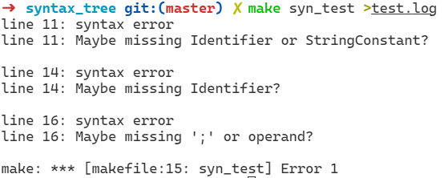

# 词法分析、语法分析程序实验

郑戈涵17338233

## 实验目的

扩充已有的样例语言TINY，为扩展TINY语言TINY＋构造词法分析和语法分析程序，从而掌握词法分析和语法分析程序的构造方法 

## 实验内容

了解样例语言TINY及TINY编译器的实现，了解扩展TINY语言TINY＋，用EBNF描述TINY＋的语法，用C语言扩展TINY的词法分析和语法分析程序，构造TINY＋的语法分析器。

## 实验要求

将TINY＋源程序翻译成对应的TOKEN序列，并能检查一定的词法错误。将TOKEN序列转换成语法分析树，并能检查一定的语法错误。

## 实验步骤

### 扩充语言

Tiny语言参考https://jlu.myweb.cs.uwindsor.ca/214/language.htm。再其上增加了几个功能：

1. while循环语句
2. 使用and 和 or的表达式
3. bool表达式增加大于小于，大于等于，小于等于的情况

增加后变化的产生式如下：

```yacc
Statement -> Block
    | LocalVarDecl
    | AssignStmt
    | ReturnStmt
    | IfStmt
    | WriteStmt
    | ReadStmt
    | WhileStmt
    ;
WhileStmt -> WHILE '(' BoolExpression ')' Statement
    ;
BoolExpression -> Expression Eq Expression 
    | Expression Ne Expression 
    | Expression '>' Expression
    | Expression '<' Expression
    | Expression Le Expression
    | Expression Ge Expression
    | BoolExpression And BoolExpression
    | BoolExpression Or BoolExpression
    ;
```

本次实验使用了linux下的flex和bison。

### 语法树定义

语法树是与分析部分无关的内容，在语法分析时作为副作用顺便生成语法树。包含三个功能，创建，遍历和删除。由于语法树是多叉树，而且分支个数不确定，因此使用二叉树来实现。具体做法是同一层次的其他叶节点按顺序依次生成右叶节点。下一层的叶节点生成在当前节点的左叶节点。定义如下：

```c
struct AST
{
    int lineNo; 
    char* name;
    struct AST *leftNode;
    struct AST *rightNode;
    union
    {
        char* idName;
        int intVal;
        float floatVal;
    };
};
```

标识符这样的语法单元在打印时需要打印具体值，因此使用union保存。

#### 创建语法树节点

由于分支个数不确定，我使用了变长参数的函数。

```c
struct AST *createASTNode(char *name, int num, ...)
{
    va_list valist;
    struct AST *root = (struct AST *)malloc(sizeof(struct AST));
    root->leftNode=root->rightNode=NULL;
    struct AST *child = (struct AST *)malloc(sizeof(struct AST));
    child->leftNode=root->rightNode=NULL;
    //examine if alloc failed
    if (!root || !child)
    {
        yyerror("RUN OUT OF MEMORY.");
        exit(0);
    }
    root->name = name;
    // init variable args
    va_start(valist, num);
    if (num > 0)
    {
        // get next argument
        child = va_arg(valist, struct AST *);
        root->leftNode = child;
        // synthesize lineNo property from child
        root->lineNo = child->lineNo;
        if (num > 1)
        {
            for (int i = 0; i < num - 1; ++i)
            {
                // generate other branch as child for tree of same level(use binary tree to simulate tree of multiple branch)
                child->rightNode = va_arg(valist, struct AST *);
                child = child->rightNode;
            }
        }
    }
    else
    {
        int arg = va_arg(valist, int);
        root->lineNo = arg;
        /* 3 case of terminal:
        *   string
        *   int
        *   float
        */
        if (!strcmp(root->name, "Identifier") || !strcmp(root->name, "StringConstant"))
        {
            char *tokenText = (char *)malloc(sizeof(char) * BUFFSIZE);
            strcpy(tokenText, yytext);
            root->idName = tokenText;
        }
        else if (!strcmp(root->name, "IntConstant"))
            root->intVal = atoi(yytext);
        else if (!strcmp(root->name, "Real"))
            root->floatVal = atof(yytext);
    }
    return root;
}
```

#### 遍历

遍历我使用的是扁平化的显示方法，同一层次的节点都对应同样大小的缩进，使用前序遍历。

```c
void traverse(struct AST *root, int level)
{
    if (!root)
        return;
    for (int i = 0; i < level; ++i)
        printf("\t");
    if (root->lineNo != -1)
    {
        printf("%s ", root->name);
        if ((!strcmp(root->name, "Identifier")))
            printf(":%s ", root->idName);
        else if (!strcmp(root->name, "StringConstant"))
            printf(":%s", root->idName);
        else if (!strcmp(root->name, "IntConstant"))
            printf(":%d", root->intVal);
        else if (!strcmp(root->name, "Real"))
            printf(":%f", root->floatVal);
        else
            printf("(%d)", root->lineNo);
    }
    printf("\n");
    traverse(root->leftNode, level + 1);
    traverse(root->rightNode, level);
}
```

#### 删除

使用后序遍历。

```c
void destroy(struct AST *root){
    if(!root)return;
    if(root->leftNode)
        destroy(root->leftNode);
    if(root->rightNode)
        destroy(root->rightNode);
    free(root);
}
```

### 语法分析

虽然原理上是先词法分析再语法分析，但是实际上是从产生式才知道需要哪些token，所以先做语法分析。

将所有产生式转换为对应的语法，并添加生成语法树的语义动作。调用上面实现的创建函数即可。产生式的左端是非终端符号。右端出现的终端符号都需要定义为token，**无论**是终端符号还是非终端符号都需要声明为**语法树节点类型**。错误处理可以使用error语法，在对应的语法下方增加一个产生式，用yyerror输出错误信息。

syn_tree.y代码如下，%left代表运算符的优先级，实际上出现冲突时bison也会自动选择一种处理方式：

```yacas
%{
#include<unistd.h>
#include<stdio.h> 
#include "syn_tree.h"
%}

%union{
struct AST* a;
}

%token <a> Le  Ge  Eq  Ne Def  And  Or  IntConstant Real  StringConstant  Identifier  Void  Int  WHILE  If  Else  Return Operator BEGIN_KEY END_KEY MAIN WRITE READ 
%type  <a> Programs Program MethodDecl FormalParams FormalParam Block Statements Statement LocalVarDecl 
Type AssignStmt  ReturnStmt IfStmt WriteStmt ReadStmt  BoolExpression Expression MultiplicativeExpr 
PrimaryExpr ActualParams WhileStmt

%left '+' '-'
%left '*' '/'
%left And Or

%%
Programs :
    Program{$$=createASTNode("Programs",1,$1);printf("Syntax tree :\n");traverse($$,0);destroy($$);}
    ;
Program : MethodDecl {$$=createASTNode("Program",1,$1);}
    |MethodDecl Program {$$=createASTNode("Program",2,$1,$2);}
    ;

MethodDecl : Type Identifier '(' FormalParams ')' Block{$$=createASTNode("MethodDecl",4,$1,$2,$4,$6);}
    | Type MAIN Identifier '(' FormalParams ')' Block{$$=createASTNode("MethodDecl",5,$1,$2,$3,$5,$7);}
    ;
FormalParams : FormalParams  ',' FormalParam{$$=createASTNode("FormalParams",2,$1,$3);}
    | FormalParam{$$=createASTNode("FormalParams",1,$1);}
    | /* empty */{$$=createASTNode("FormalParams",0,-1);}
    ;
FormalParam : Type Identifier{$$=createASTNode("FormalParam",2,$1,$2);}
    ;


Block : BEGIN_KEY Statements END_KEY {$$=createASTNode("Block",3,$1,$2,$3);}
    | error  { yyerror("keyword typo? \n"); }
    ;

Statements :Statements Statement{$$=createASTNode("Statements",2,$1,$2);}
    | Statement{$$=createASTNode("Statements",1,$1);}
    ;

Statement : Block{$$=createASTNode("Statement",1,$1);}
    | LocalVarDecl{$$=createASTNode("Statement",1,$1);}
    | AssignStmt{$$=createASTNode("Statement",1,$1);}
    | ReturnStmt{$$=createASTNode("Statement",1,$1);}
    | IfStmt{$$=createASTNode("Statement",1,$1);}
    | WriteStmt{$$=createASTNode("Statement",1,$1);}
    | ReadStmt{$$=createASTNode("Statement",1,$1);}
    | WhileStmt{$$=createASTNode("Statement",1,$1);}
    ;


LocalVarDecl : Type Identifier ';' {$$=createASTNode("LocalVarDecl",2,$1,$2);}
    | Type AssignStmt  {$$=createASTNode("LocalVarDecl",2,$1,$2);}
    | Type error ';' { yyerror("Maybe missing Identifier? \n"); }
    ;

WhileStmt : WHILE '(' BoolExpression ')' Statement{$$=createASTNode("WhileStmt",3,$1,$3,$5);}
    ;


Type : Int{$$=createASTNode("Type",1,$1);}
    | Real{$$=createASTNode("Type",1,$1);}
    | StringConstant{$$=createASTNode("Type",1,$1);}
    ;

AssignStmt  : Identifier Def Expression ';'{$$=createASTNode("AssignStmt",3,$1,$2,$3);}
    |  Identifier Def StringConstant ';'{$$=createASTNode("AssignStmt",3,$1,$2,$3);}
    | error ';' { yyerror("Maybe missing ';'? \n"); }
    ;
ReturnStmt : Return Expression ';'{$$=createASTNode("ReturnStmt",2,$1,$2);}
    ;
IfStmt : If '(' BoolExpression ')' Statement{$$=createASTNode("IfStmt",3,$1,$3,$5);}
    | If '(' BoolExpression ')' Statement Else Statement{$$=createASTNode("IfStmt",5,$1,$3,$5,$6,$7);}
    ;
WriteStmt : WRITE '(' Expression ',' StringConstant ')' ';'{$$=createASTNode("WriteStmt",3,$1,$3,$5);}
    | WRITE error ';' { yyerror("Maybe missing Identifier or StringConstant? \n"); }
    ;
ReadStmt  : READ '(' Identifier ',' StringConstant ')' ';'{$$=createASTNode("ReadStmt",3,$1,$3,$5);}
    | READ error ';' { yyerror("Maybe missing Identifier or StringConstant? \n"); }
    ;

BoolExpression : Expression Eq Expression {$$=createASTNode("BoolExpression",3,$1,$2,$3);}
    | Expression Ne Expression {$$=createASTNode("BoolExpression",3,$1,$2,$3);}
    | Expression '>' Expression{$$=createASTNode("BoolExpression",3,$1,createASTNode("Operator(>)",0,yylineno),$3);}
    | Expression '<' Expression{$$=createASTNode("BoolExpression",3,$1,createASTNode("Operator(<)",0,yylineno),$3);}
    | Expression Le Expression{$$=createASTNode("BoolExpression",3,$1,$2,$3);}
    | Expression Ge Expression{$$=createASTNode("BoolExpression",3,$1,$2,$3);}
    | BoolExpression And BoolExpression{$$=createASTNode("BoolExpression",3,$1,$2,$3);}
    | BoolExpression Or BoolExpression{$$=createASTNode("BoolExpression",3,$1,$2,$3);}
    ;

Expression : Expression   '+' MultiplicativeExpr {$$=createASTNode("Expression",3,$1,createASTNode("Operator(+)",0,yylineno),$3);}
    | Expression '-' MultiplicativeExpr{$$=createASTNode("Expression",3,$1,createASTNode("Operator(-)",0,yylineno),$3);}
    | MultiplicativeExpr{$$=createASTNode("Expression",1,$1);}
    | error ';' { yyerror("Maybe missing ';' or operand? \n"); }
    ;
MultiplicativeExpr : MultiplicativeExpr '*' PrimaryExpr{$$=createASTNode("MultiplicativeExpr",3,$1,createASTNode("Operator(*)",0,yylineno),$3);}
    | MultiplicativeExpr '/'  PrimaryExpr{$$=createASTNode("MultiplicativeExpr",3,$1,createASTNode("Operator(/)",0,yylineno),$3);}
    | PrimaryExpr{$$=createASTNode("MultiplicativeExpr",1,$1);}
    ;
PrimaryExpr : IntConstant {$$=createASTNode("PrimaryExpr",1,$1);}
    | Real {$$=createASTNode("PrimaryExpr",1,$1);}
    | Identifier {$$=createASTNode("PrimaryExpr",1,$1);}
    | '(' Expression ')' {$$=createASTNode("PrimaryExpr",1,$2);}
    | Identifier '(' ActualParams ')'{$$=createASTNode("PrimaryExpr",2,$1,$3);}
    ;
ActualParams : ActualParams  ',' Expression{$$=createASTNode("ActualParams",2,$1,$3);}
    |  Expression{$$=createASTNode("ActualParams",1,$1);}
    ;
%%
```

### 词法分析

词法分析用到的token都在语法分析时决定了，因此将其声明在规则中，在后面追加一个语法块决定捕获到token时执行的动作，对于生成语法树来说需要生成叶节点供语法分析时使用。对于单纯的词法分析只需要返回token枚举。lexer.l代码如下：

```
%{
#include "syn_tree.h"
#include "syn_tree.tab.h"
int cur_line_num = 1;
void lex_error(char* msg, int line);

%}
%option yylineno

DIGIT               ([0-9]+)
NUMBER              {DIGIT}.{DIGIT}
STRING              (\042[^\042\n]*\042)
OPERATOR            ([+*-/%=,;!<>(){}])
SINGLE_COMMENT1     ("//"[^\n]*)
SINGLE_COMMENT2     (\/\*\*.*?\*\*\/)
Identifier          ([_a-zA-Z][_a-zA-Z0-9]*)

%%

[\n]                { cur_line_num++;                       }
[ \t\r\a]+          { /* ignore all spaces */               }
{SINGLE_COMMENT1}   { /* skip for single line comment */    }
{SINGLE_COMMENT2}   { /* skip for single line commnet */    }

{OPERATOR}          { yylval.a=createASTNode("OP",0,yylineno);return yytext[0];         }   

"<="                { yylval.a=createASTNode("Le",0,yylineno);return Le;              }
">="                { yylval.a=createASTNode("Ge",0,yylineno);return Ge;              }
":="                { yylval.a=createASTNode("Def",0,yylineno);return Def;              }
"=="                { yylval.a=createASTNode("Eq",0,yylineno);return Eq;              }
"!="                { yylval.a=createASTNode("Ne",0,yylineno);return Ne;              }
"&&"                { yylval.a=createASTNode("And",0,yylineno);return And;             }
"||"                { yylval.a=createASTNode("Or",0,yylineno);return Or;              }
"INT"               { yylval.a=createASTNode("Int",0,yylineno);return Int;             }
"WHILE"             { yylval.a=createASTNode("WHILE",0,yylineno);return WHILE;           }
"IF"                { yylval.a=createASTNode("If",0,yylineno);return If;              }
"ELSE"              { yylval.a=createASTNode("Else",0,yylineno);return Else;            }
"RETURN"            { yylval.a=createASTNode("Return",0,yylineno);return Return;          }
"WRITE"             { yylval.a=createASTNode("WRITE",0,yylineno);return WRITE;           }
"READ"           { yylval.a=createASTNode("READ",0,yylineno);return READ;         }
"BEGIN"           { yylval.a=createASTNode("BEGIN",0,yylineno);return BEGIN_KEY;         }
"END"           { yylval.a=createASTNode("END",0,yylineno);return END_KEY;         }
"MAIN"           { yylval.a=createASTNode("END",0,yylineno);return MAIN;         }

{DIGIT}                 {yylval.a=createASTNode("IntConstant",0,yylineno); return IntConstant;     }
{NUMBER}                { yylval.a=createASTNode("Real",0,yylineno);return Real;     }
{STRING}                { yylval.a=createASTNode("StringConstant",0,yylineno);return StringConstant;  }
{Identifier}            {  yylval.a=createASTNode("Identifier",0,yylineno);return Identifier;      }

<<EOF>>             { return 0; }

.                   { lex_error("Unrecognized character", cur_line_num);        }

%%

void lex_error(char* msg, int line) {
    printf("\nError at line %-3d: %s\n\n", line, msg);
}

int yywrap(void) {
    return 1;
}
```

生成代码使用makefile，如下：

```makefile
CC=gcc
TARGET= main
LEXER= lex
TESTFILE=test.cpp
all: $(TARGET) lex


lex_test: lex
	./$(LEXER) < $(TESTFILE)

$(LEXER): lex_only.yy.c main.c
	$(CC) -o $@  $^ -DLEX

syn_test: $(TARGET) $(TESTFILE)
	./$(TARGET) < $(TESTFILE)

$(TARGET): main.c syn_tree.tab.c lex.yy.c syn_tree.c 

syn_tree.tab.c:syn_tree.y
	bison -d  syn_tree.y

lex_only.yy.c: lex_only.l
	flex -o $@ $< 

lex.yy.c: lexer.l
	flex $< 

check:$(TARGET)
	valgrind --leak-check=full \
			--show-leak-kinds=all \
			--track-origins=yes \
			--verbose \
			--log-file=valgrind-out.txt \
			./$(TARGET)<$(TESTFILE)

clean:
	rm syn_tree.tab.c *.yy.c syn_tree.tab.h $(LEXER) $(TARGET) 2> /dev/null || echo > /dev/null
```

## 实验结果

使用网站提供的测试代码，修改11行加入新特性。

```
/** this is a comment line in the sample program **/
 INT f2(INT x, INT y ) 
 BEGIN 
    INT z;
    z := x*x - y*y;
    RETURN z; 
 END 
 INT MAIN f1() 
 BEGIN
    INT x;
    WHILE(x<3 && y>3) READ(x, "A41.input");
    INT y;
    READ(y, "A42.input");
    INT z;
    z := f2(x,y) + f2(y,x);
    WRITE (z, "A4.output"); 
 END
```

### 词法分析

使用下面的命令进行词法分析，

```shell
make lex_test > test.log
```

test.log中的结果如下：

```
flex -o lex_only.yy.c lex_only.l 
gcc -o lex  lex_only.yy.c main.c -DLEX
./lex < test.cpp
(Int,INT)
(Identifier,f2)
((,()
(Int,INT)
(Identifier,x)
(,,,)
(Int,INT)
(Identifier,y)
(),))
(BEGIN_KEY,BEGIN)
(Int,INT)
(Identifier,z)
(;,;)
(Identifier,z)
(Def,:=)
(Identifier,x)
(*,*)
(Identifier,x)
(-,-)
(Identifier,y)
(*,*)
(Identifier,y)
(;,;)
(Return,RETURN)
(Identifier,z)
(;,;)
(END_KEY,END)
(Int,INT)
(MAIN,MAIN)
(Identifier,f1)
((,()
(),))
(BEGIN_KEY,BEGIN)
(Int,INT)
(Identifier,x)
(;,;)
(WHILE,WHILE)
((,()
(Identifier,x)
(<,<)
(IntConstant,3)
(And,&&)
(Identifier,y)
(>,>)
(IntConstant,3)
(),))
(READ,READ)
((,()
(Identifier,x)
(,,,)
(StringConstant,"A41.input")
(),))
(;,;)
(Int,INT)
(Identifier,y)
(;,;)
(READ,READ)
((,()
(Identifier,y)
(,,,)
(StringConstant,"A42.input")
(),))
(;,;)
(Int,INT)
(Identifier,z)
(;,;)
(Identifier,z)
(Def,:=)
(Identifier,f2)
((,()
(Identifier,x)
(,,,)
(Identifier,y)
(),))
(+,+)
(Identifier,f2)
((,()
(Identifier,y)
(,,,)
(Identifier,x)
(),))
(;,;)
(WRITE,WRITE)
((,()
(Identifier,z)
(,,,)
(StringConstant,"A4.output")
(),))
(;,;)
(END_KEY,END)

```

### 语法分析

使用下面的命令进行语法分析，

```shell
make syn_test >test.log
```

test.log中的结果如下：


```
bison -d  syn_tree.y
flex lexer.l 
gcc     main.c syn_tree.tab.c lex.yy.c syn_tree.c   -o main
./main < test.cpp
>Syntax tree :
Programs (2)
	Program (2)
		MethodDecl (2)
			Type (2)
				Int (2)
			Identifier :f2 
			FormalParams (2)
				FormalParams (2)
					FormalParam (2)
						Type (2)
							Int (2)
						Identifier :x 
				FormalParam (2)
					Type (2)
						Int (2)
					Identifier :y 
			Block (3)
				BEGIN (3)
				Statements (4)
					Statements (4)
						Statements (4)
							Statement (4)
								LocalVarDecl (4)
									Type (4)
										Int (4)
									Identifier :z 
						Statement (5)
							AssignStmt (5)
								Identifier :z 
								Def (5)
								Expression (5)
									Expression (5)
										MultiplicativeExpr (5)
											MultiplicativeExpr (5)
												PrimaryExpr (5)
													Identifier :x 
											Operator(*) (5)
											PrimaryExpr (5)
												Identifier :x 
									Operator(-) (5)
									MultiplicativeExpr (5)
										MultiplicativeExpr (5)
											PrimaryExpr (5)
												Identifier :y 
										Operator(*) (5)
										PrimaryExpr (5)
											Identifier :y 
					Statement (6)
						ReturnStmt (6)
							Return (6)
							Expression (6)
								MultiplicativeExpr (6)
									PrimaryExpr (6)
										Identifier :z 
				END (7)
		Program (8)
			MethodDecl (8)
				Type (8)
					Int (8)
				END (8)
				Identifier :f1 
				
				Block (9)
					BEGIN (9)
					Statements (10)
						Statements (10)
							Statements (10)
								Statements (10)
									Statements (10)
										Statements (10)
											Statements (10)
												Statement (10)
													LocalVarDecl (10)
														Type (10)
															Int (10)
														Identifier :x 
											Statement (11)
												WhileStmt (11)
													WHILE (11)
													BoolExpression (11)
														BoolExpression (11)
															Expression (11)
																MultiplicativeExpr (11)
																	PrimaryExpr (11)
																		Identifier :x 
															Operator(<) (11)
															Expression (11)
																MultiplicativeExpr (11)
																	PrimaryExpr (11)
																		IntConstant :3
														And (11)
														BoolExpression (11)
															Expression (11)
																MultiplicativeExpr (11)
																	PrimaryExpr (11)
																		Identifier :y 
															Operator(>) (11)
															Expression (11)
																MultiplicativeExpr (11)
																	PrimaryExpr (11)
																		IntConstant :3
													Statement (11)
														ReadStmt (11)
															READ (11)
															Identifier :x 
															StringConstant :"A41.input"
										Statement (12)
											LocalVarDecl (12)
												Type (12)
													Int (12)
												Identifier :y 
									Statement (13)
										ReadStmt (13)
											READ (13)
											Identifier :y 
											StringConstant :"A42.input"
								Statement (14)
									LocalVarDecl (14)
										Type (14)
											Int (14)
										Identifier :z 
							Statement (15)
								AssignStmt (15)
									Identifier :z 
									Def (15)
									Expression (15)
										Expression (15)
											MultiplicativeExpr (15)
												PrimaryExpr (15)
													Identifier :f2 
													ActualParams (15)
														ActualParams (15)
															Expression (15)
																MultiplicativeExpr (15)
																	PrimaryExpr (15)
																		Identifier :x 
														Expression (15)
															MultiplicativeExpr (15)
																PrimaryExpr (15)
																	Identifier :y 
										Operator(+) (15)
										MultiplicativeExpr (15)
											PrimaryExpr (15)
												Identifier :f2 
												ActualParams (15)
													ActualParams (15)
														Expression (15)
															MultiplicativeExpr (15)
																PrimaryExpr (15)
																	Identifier :y 
													Expression (15)
														MultiplicativeExpr (15)
															PrimaryExpr (15)
																Identifier :x 
						Statement (16)
							WriteStmt (16)
								WRITE (16)
								Expression (16)
									MultiplicativeExpr (16)
										PrimaryExpr (16)
											Identifier :z 
								StringConstant :"A4.output"
					END (17)

```

### 错误处理

在原来的代码中增加几个错误：

1. 11行没有第二个参数，即READ函数对应的文件的标识符。

2. 14行缺少变量名
3. 16行缺少分号

```
/** this is a comment line in the sample program **/
 INT f2(INT x, INT y ) 
 BEGIN 
    INT z;
    z := x*x - y*y;
    RETURN z; 
 END 
 INT MAIN f1() 
 BEGIN
    INT x;
    WHILE(x<3 && y>3) READ(x, );
    INT y;
    READ(y, "A42.input");
    INT ;
    z := f2(x,y) + f2(y,x);
    WRITE (z, "A4.output") 
 END
```

测试结果如下：



