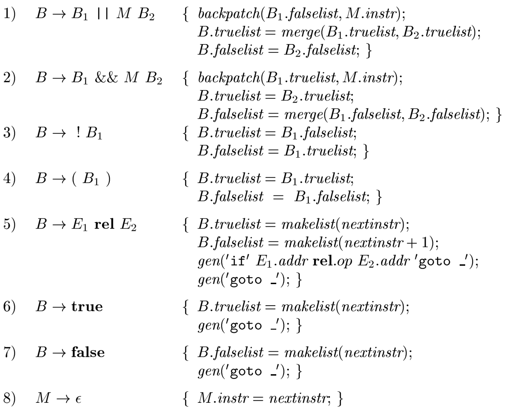
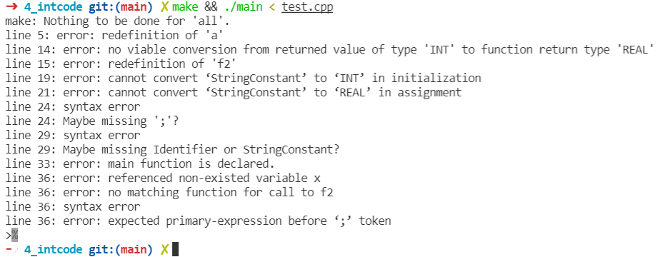

# <center>语义分析程序及中间代码生成实验</center>

<center>郑戈涵17338233</center>

## 实验目的

构造TINY＋的语义分析程序并生成中间代码。

## 实验内容

构造符号表，用C语言扩展TINY的语义分析程序，构造TINY＋的语义分析器，构造TINY＋的中间代码生成器。

## 实验要求

能检查一定的语义错误，将TINY＋程序转换成三地址中间代码。

## 实验步骤

整个翻译工作由一个翻译器类的实例来管理，他被声明为静态变量。其中两个栈tblSt，offsetSt是实现符号表的核心。intCodeGenerator类的实例generator用于生成中间代码。

```c++
class translator
{
private:
    string code;

public:
    translator();
    ~translator() = default;
    void addwidth(int width);
    shared_ptr<symbol_table> t = nullptr;
    stack<shared_ptr<symbol_table>> tblSt;
    stack<int> offsetSt;
    intCodeGenerator generator;
    string lookup(string idName,int floor=0,bool errFlag=true);
    shared_ptr<symbol_table::entry> getEntry(string idName,int floor=0,bool errFlag=true);
    string newTemp();
    int nextQuad(){return generator.quadCnt();}
    void backpatch(shared_ptr<list<int>>l,int quad);
    bool isDupVar(string varName)const;

};
```

每个非终端符号声明为节点指针，词法分析时保存得到的词法值。规约时保存语法分析中得到的信息。

```c++
struct node
{
    node()=default;
    explicit node(int lineNo, const node &n);
    explicit node(int lineNo, const node &n,shared_ptr<list<int>> truelist,shared_ptr<list<int>> falselist,shared_ptr<list<int>>nextlist);
    explicit node(int lineNo, shared_ptr<list<int>> truelist,shared_ptr<list<int>> falselist,shared_ptr<list<int>> nextlist);
    explicit node(int lineNo, int quad):_lineNo(lineNo),_quad(quad);
    explicit node(int lineNo,string addr=string(),string code=string()):_lineNo(lineNo),_addr(addr),_code(code);
    explicit node(int lineNo,vector<string>typeStack):_lineNo(lineNo),_typeStack(typeStack);
    explicit node(int lineNo, const node &n, string type):_lineNo(lineNo);
    int _lineNo;
    string typeName; //type name
    string idName;
    int intVal = 0;
    float floatVal = 0;
    string _code;
    string _addr;
    shared_ptr<list<int>> _truelist,_falselist,_nextlist;
    vector<string>_typeStack;
    int _quad=0;
};
```

### 构造符号表

由于变量具有作用域，而且可以嵌套，需要使用一个栈来指明当前分析的变量属于哪一个作用域。

符号表中的表项有两种，变量和函数，除变量名都需要记录外，函数需要记录参数的类型用于类型检查，还需要记录是否为main函数（main函数只有一个）。变量需要记录数据大小以及表中的偏移。声明如下：

```c++
struct entry
{
    string identifier;
    string _type;
    bool isFunc;
    bool isMain;
    int addr;
    shared_ptr<vector<string>> typeStack;
    shared_ptr<symbol_table> fptr;
    string retType;
};
```

符号表有三个核心动作，enter负责将变量记录在表中，enterproc负责将函数记录在表中，addwidth负责修改当前的总偏移量。

```c++
class symbol_table
{
public:
    struct entry;
    symbol_table()=default;
    symbol_table(shared_ptr<symbol_table> t);
    ~symbol_table()=default;
    bool enter(string lexeme, string type, int offset);
    bool enterproc(string lexeme, string retType, shared_ptr<symbol_table> fptr,vector<string>param, bool isMain=false);
    void addwidth(int width);
    string newTemp();
    string lookup(string idName,bool errFlag);
    shared_ptr<entry> getEntry(string idName,bool errFlag);
    int size() const;
    const map<string, symbol_table::entry> &table() const;
    friend ostream &operator<<(ostream &os, shared_ptr<symbol_table> t);

private:
    map<string, entry> _table;
    shared_ptr<symbol_table> prev = nullptr;
    int _size = 0;
    int tmpCnt=0;
};
```

newTemp函数在处理表达式时生成临时变量时使用。

涉及到符号表的SDT有非终端符号Programs，MethodDecl，FormalParam，LocalVarDecl。

#### Programs

规约program前初始化两个栈的信息，规约完成时填好整个符号表的总偏移。

```c++
Programs :{global_tab.tblSt.push(global_tab.t);global_tab.offsetSt.push(0);}Program{global_tab.tblSt.top()->addwidth(global_tab.offsetSt.top());global_tab.tblSt.pop();global_tab.offsetSt.pop();
        ofstream codestm("test.ll");
        codestm<<global_tab.generator.postProcess()<<endl;
        ofstream symTabStm("symbolTable.txt");
        symTabStm<<global_tab.t<<endl;
    }
    ;
```

#### MethodDecl

规约前建立表项并设置新的两个栈顶，说明当前的作用域已经改变。规约后调用enterproc将其记录进表。对于main函数基本是完全一样的处理。

```c++
MethodDecl :N Type Identifier O '(' FormalParams ')'  Block{
        auto tmp=global_tab.tblSt.top();
        tmp->addwidth(global_tab.offsetSt.top());
        global_tab.tblSt.pop();
        global_tab.offsetSt.pop();
        global_tab.tblSt.top()->enterproc($3->idName,$2->typeName,tmp,$6->_typeStack);
    }
    |N Type MAIN{if(global_tab.t->mainDeclared)yyerror("error: main function is declared.");
        global_tab.t->mainDeclared=true;} Identifier{if(global_tab.isDupVar($5->idName))yyerrorStr("error: redefinition of '"+$5->idName+'\'');} O '(' FormalParams ')'  Block
    {
        auto tmp=global_tab.tblSt.top();
        tmp->addwidth(global_tab.offsetSt.top());
        global_tab.tblSt.pop();
        global_tab.offsetSt.pop();
        global_tab.tblSt.top()->enterproc($5->idName,$2->typeName,tmp,$9->_typeStack,true);
    }
    ;
N: /* empty */{auto t=mktable(global_tab.tblSt.top());
                global_tab.tblSt.push(t);
                global_tab.offsetSt.push(0);}
    ;
O: /* empty */{global_tab.generator.gen(tmpIdName);}
    ;
```

#### FormalParams

由于函数的形参也是函数体中可以访问的变量，作用域为整个函数体，因此规约出FormalParam的时候也需要记录到符号表里。

```c++
FormalParams : FormalParams  ',' FormalParam{$$=new node(yylineno,*$1,$3->typeName);}
    | FormalParam{$$=new node(yylineno,vector<string>({$1->typeName}));}
    | /* empty */{}
    ;
FormalParam : Type Identifier{global_tab.tblSt.top()->enter($2->idName,$1->typeName,global_tab.offsetSt.top());global_tab.addwidth(type2size[$1->typeName]);
    $$->typeName=$1->typeName;
    }
    ;
```

由于参数的个数不确定，我使用vector记录参数，规约FormalParam时会同时记录到参数表里。

#### LocalVarDecl

规约到LocalVarDecl时将变量的信息填入符号表。由于赋值语句中变量的标识符在其产生式中没有出现，在规约AssignStmt时得到，所以应该使用综合属性传递。

```c++
LocalVarDecl : Type Identifier ';' {
    if(!global_tab.lookup($2->idName,0,false).empty()){
        yyerrorStr(string("duplicated definition for ")+$2->idName);
    }
    global_tab.tblSt.top()->enter($2->idName,$1->typeName,global_tab.offsetSt.top());
    global_tab.addwidth(type2size[$1->typeName]);
    
    }
    | Type AssignStmt  {global_tab.tblSt.top()->enter(tmpIdName,$1->typeName,global_tab.offsetSt.top());
                        global_tab.addwidth(type2size[$1->typeName]);}
    | Type error ';' { yyerror("Maybe missing Identifier?"); }
    ;
```

### 生成中间代码

中间代码有三类：

* 赋值语句
* 函数调用语句
* 控制流语句

本语言的控制流有while和if两种，在实现这两种之前，先实现布尔表达式的SDT。整个控制流语句的SDT都采用回填技术。此外中间代码中还需要生成标号。

中间代码可以抽象为四元组，即result，op，arg1，arg2，因此设计结构体存储一个四元组

```c++
struct codeQuad
{
    string _op, _arg1, _arg2, _result;
    string _label;
    bool isLabel;
    codeQuad(string op, string result, string arg1 = string(), string arg2 = string());
    codeQuad(string label) : _label(label), isLabel(true) {}
};
```

中间代码生成器类负责存储和生成导出（读写文件）中间代码。翻译器类中保存一个实例，可以在yacc文件中调用其方法。

```c++
class intCodeGenerator
{
public:
    friend class translator;
    struct codeQuad;
    intCodeGenerator() = default;
    ~intCodeGenerator() = default;
    void gen(string op, string result, string arg1 = string(), string arg2 = string());
    void gen(string label);
    intCodeGenerator& postProcess();

    friend ostream &operator<<(ostream &os, const intCodeGenerator &t);
    int quadCnt(){return ct.size();}
private:
    string Quad2Str(const codeQuad &c) const;
    vector<codeQuad> ct;
    int labelCnt=0;
};

```

核心函数为gen函数，分为生成语句和生成标号两种。

利用codeQuad的构造函数，gen函数可以很容易生成四元组和标号。

```c++
void intCodeGenerator::gen(string op, string result, string arg1, string arg2)
{
    ct.emplace_back(op, result, arg1, arg2);
}
void intCodeGenerator::gen(string label)
{
    ct.emplace_back(label);
}
```

#### 标号

##### MethodDecl

MethodDecl中需要生成标号，调用函数时会跳转到该位置。

#### 赋值语句

##### AssignStmt

规约时可以拿到四元组所需的信息，调用gen函数来生成四元组。

```c++
AssignStmt  : Identifier Def Expression ';'{
    tmpIdName=$1->idName;
    if(isTypeDef){global_tab.generator.gen("=",$1->idName,$3->_addr);isTypeDef=false;}
    else
        global_tab.generator.gen("=",(global_tab.lookup($1->idName,0).empty()?"":$1->idName),$3->_addr);
    }
    |  Identifier Def StringConstant ';'{tmpIdName=$1->idName;global_tab.generator.gen("=",$1->idName,$3->idName);}
    | error ';' { yyerror("Maybe missing ';'?"); }
    ;
```

##### Expression

参考课本的SDT，代码如下：


```c++
Expression : Expression  '+' Expression {$$=new node(yylineno,global_tab.newTemp());global_tab.generator.gen("+",$$->_addr,$1->_addr,$3->_addr);$$->typeName=typeExpand($1->typeName,$3->typeName);}
    | Expression '-' Expression{$$=new node(yylineno,global_tab.newTemp());global_tab.generator.gen("-",$$->_addr,$1->_addr,$3->_addr);$$->typeName=typeExpand($1->typeName,$3->typeName);}
    | Expression '*' Expression{$$=new node(yylineno,global_tab.newTemp());global_tab.generator.gen("*",$$->_addr,$1->_addr,$3->_addr);$$->typeName=typeExpand($1->typeName,$3->typeName);}
    | Expression '/' Expression{$$=new node(yylineno,global_tab.newTemp());global_tab.generator.gen("/",$$->_addr,$1->_addr,$3->_addr);$$->typeName=typeExpand($1->typeName,$3->typeName);}
    | IntConstant {$$=new node(yylineno,to_string($1->intVal));$$->typeName="INT";}
    | RealConstant {$$=new node(yylineno,to_string($1->floatVal));$$->typeName="REAL";}
    | '(' Expression ')' {$$=new node(yylineno,*$2);$$->typeName=$2->typeName;}
    | error ';' { yyerror("Maybe missing ';' or operand?"); }
    ;
```

为了方便类型检查，表达式在规约时计算左边的类型。

#### 函数调用语句

参考课本的例子，对实参依次使用param，然后call函数名并带上参数个数。代码如下：

```c++
Expression : Identifier '(' ActualParams ')'{
        auto entry=global_tab.getEntry($1->idName,1);
        if(!entry||$3->_typeStack!=*entry->typeStack){
            yyerrorStr(string("no matching function for call to ") + $1->idName + ".");
            $$=new node(yylineno,global_tab.newTemp());
            global_tab.generator.gen("call",$$->_addr,$1->idName,to_string(funcArgNum));
            funcArgNum=0;
        }else{
            $$=new node(yylineno,global_tab.newTemp());
            $$->typeName=entry->retType;
            global_tab.generator.gen("call",$$->_addr,$1->idName,to_string(funcArgNum));
            funcArgNum=0;
        }
    }
	;

ActualParams : ActualParams  ',' Expression{global_tab.generator.gen("param",$3->_addr);funcArgNum++;$$->_typeStack.push_back($3->typeName);}
    |  Expression{global_tab.generator.gen("param",$1->_addr);funcArgNum++;$$->_typeStack={$1->typeName};}
    ;
```

在规约函数调用时，会对照符号表中的函数的参数表，确认实参和形参的类型以及个数是否一致。

#### 布尔表达式

参考课本中的翻译方案：



本语言没有其中的部分产生式。代码如下：

```c++
BoolExpression : Expression RELOP Expression{
    $$->_truelist=mkList(global_tab.nextQuad());
    $$->_falselist=mkList(global_tab.nextQuad()+1);
    global_tab.generator.gen($2->idName,"_",$1->_addr,$3->_addr);
    global_tab.generator.gen("goto","_");
}
    | BoolExpression And M BoolExpression{
        $$=new node(yylineno,make_shared<list<int>>(),make_shared<list<int>>(),make_shared<list<int>>());
        global_tab.backpatch($1->_truelist,$3->_quad);
        *$$->_truelist=*$4->_truelist;
        *$$->_falselist=*$1->_falselist;
        $$->_falselist->merge(*$4->_falselist);
    }
    | BoolExpression Or M BoolExpression{
        $$=new node(yylineno,make_shared<list<int>>(),make_shared<list<int>>(),make_shared<list<int>>());
        global_tab.backpatch($1->_falselist,$3->_quad);
        $$->_truelist=$1->_truelist;
        $$->_truelist->merge(*$4->_truelist);
        $$->_falselist=$4->_falselist;
    }
    ;
```

#### 控制流语句

##### 顺序语句

在语句都生成时，规约出句子，此时对前一个句子组的nextlist进行回填。

```c++
Statements :Statements M Statement{global_tab.backpatch($1->_nextlist,$2->_quad);$$=new node(yylineno,*$3);}
    | Statement{$$=new node(yylineno,*$1);}
    | /* empty */{}
    ;
```

##### IfStmt

参考课本的if语句的SDT:


代码如下：

```c++
IfStmt : 
    If '(' BoolExpression ')' M Statement {$<a>$=new node(yylineno,global_tab.nextQuad());$<a>$->_nextlist=mkList(global_tab.nextQuad());global_tab.generator.gen("goto","_");} Else M Statement{
    $$=new node(yylineno,make_shared<list<int>>(),make_shared<list<int>>(),make_shared<list<int>>(*$6->_nextlist));
    global_tab.backpatch($3->_truelist,$5->_quad);
    global_tab.backpatch($3->_falselist,$9->_quad);
    $$->_nextlist->merge(*$<a>7->_nextlist);
    $$->_nextlist->merge(*$10->_nextlist);
    }
    | If '(' BoolExpression ')' M Statement{
    $$=new node(yylineno,make_shared<list<int>>(),make_shared<list<int>>(),make_shared<list<int>>(*$3->_falselist));
    global_tab.backpatch($3->_truelist,$5->_quad);
    $$->_nextlist->merge(*$6->_nextlist);
}
    ;
```

##### WhileStmt

参考课本的if语句的SDT:


代码如下：

```c++
WhileStmt : WHILE M '(' BoolExpression ')' M Statement{
    global_tab.backpatch($7->_nextlist,$2->_quad);
    global_tab.backpatch($4->_truelist,$6->_quad);
    $$=new node(yylineno,make_shared<list<int>>(),make_shared<list<int>>(),make_shared<list<int>>(*$4->_falselist));
    global_tab.generator.gen("goto", to_string($2->_quad));
}
    ;
```

#### 其他语句

除了上述语句外，本语言中还有return和read,write语句。read和write我设计为函数，其中的参数就当做函数的实参来生成中间代码。return函数只需要生成return语句。

```c++
ReturnStmt : Return Expression ';'{global_tab.generator.gen("return",$2->_addr);}
WriteStmt : WRITE '(' Expression ',' StringConstant ')' ';'{$$=new node(yylineno,global_tab.newTemp());
global_tab.generator.gen("param",$3->_addr);
global_tab.generator.gen("param",$5->idName);
global_tab.generator.gen("write","2");}
    | WRITE error ';' { yyerror("Maybe missing Identifier or StringConstant?"); }
    ;
ReadStmt  : READ '(' Identifier ',' StringConstant ')' ';'{$$=new node(yylineno,global_tab.newTemp());
global_tab.generator.gen("param",$3->idName);
global_tab.generator.gen("param",$5->idName);
global_tab.generator.gen("read","2");}
    | READ error ';' { yyerror("Maybe missing Identifier or StringConstant?"); }
    ;
```

但是本语言比较特殊，他不允许表达式在赋值语句，write语句和返回语句之外的位置出现，而函数调用实际上会规约为表达式，因此在输出中间代码时处理，我添加了一些信息将其包装为函数调用语句，在输出时通过信号得知语句类型，除去额外信息再输出为中间代码。

## 语义错误检查

实现了以下错误的检查：

1. 变量在使用时未经定义。输出Referenced non-existed variable ‘xxx’
2. 函数在调用时未经定义。输出Referenced non-existed variable ‘xxx’
3. 变量出现重复定义。输出redefinition of 'xxx'
4. 函数出现重复定义（即同样的函数名出现了不止一次定义）。输出redefinition of 'xxx'
5. MAIN函数出现重复定义（即MAIN函数出现了不止一次定义）。输出main function is declared
6. 赋值号两边的表达式类型不匹配。本语言仅允许表达式计算时的隐式转换。定义时要求显式的类型匹配。输出cannot convert ‘xxx'’ to ‘xxx’ in assignment
7. 赋值号左边出现一个只有右值的表达式(语法分析时即不允许)。输出Maybe missing ';'?
8. 操作数类型不匹配或操作数类型与操作符不匹配。输出expected primary-expression before ‘;’ token
9. return语句的返回类型与函数定义的返回类型不匹配。输出no viable conversion from returned value of type 'xxx' to function return type 'xxx'
10. 函数调用时实参与形参的数目或类型不匹配。输出no matching function for call to 'xxx'
11. READ和WRITE函数调用时形参的数目或类型不匹配，输出Maybe missing Identifier or StringConstant?

## 实验结果

本程序使用g++,yacc进行编译。

makefile如下：

```makefile
CXX=g++
CXXFLAGS=-Wno-write-strings -DYACC
TARGET= main
LEXER= lex
TESTFILE=test.cpp
all: syn_tree.tab.c $(TARGET)


syn_test: $(TARGET) $(TESTFILE)
	./$(TARGET) < $(TESTFILE)

$(TARGET): main.cpp translator.cpp lex.yy.c syn_tree.c  

syn_tree.tab.c:syn_tree.y
	bison -vdt  $<
	
lex.yy.c: lexer.l
	flex $< 

check:$(TARGET)
	valgrind --leak-check=full \
			--show-leak-kinds=all \
			--track-origins=yes \
			--verbose \
			--log-file=valgrind-out.txt \
			./$(TARGET)<$(TESTFILE)

clean_temps:
	rm valgrind-out.txt *.log *.tab.c *.yy.c *.tab.h *.output *.exe *.ll *.txt 2> /dev/null || echo > /dev/null

clean: clean_temps
	rm $(LEXER) $(TARGET) 2> /dev/null || echo > /dev/null
```

使用命令`make`生成可执行文件main，执行

```shell
./main < test.cpp
```

在目录下产生两个文件，符号表`symbolTable.txt`和中间代码`test.ll`。

### 合法代码测试

测试代码如下：

```c++
/** this is a comment line in the sample program **/
 INT f2(INT x, REAL y ) 
 BEGIN 
    INT z;
    z := x*x - y*y;
    RETURN z; 
 END 

 INT MAIN f1() 
 BEGIN
    INT x:=3;
    REAL y:=-333.33;
    WHILE(x<3 && y>3) READ(x, "A41.input");
    INT z;
    IF(x-y<3)
    BEGIN
        READ(y, "A42.input");
        IF(x-y<2)
            READ(x, "A42.input");
            WRITE (z, "A4.output"); 
    END
    z := f2(x,y) + f2(x,y);
 END
```

产生的符号表如下：

```
----------------------------------------------
<table>main         |0
----------------------------------------------
f1<main>            |FUNC    |INT()
f2                  |FUNC    |INT(INT  REAL )
----------------------------------------------

----------------------------------------------
<table>f1           |12
----------------------------------------------
x                   |INT     |0
y                   |REAL    |4
z                   |INT     |8
----------------------------------------------

----------------------------------------------
<table>f2           |12
----------------------------------------------
x                   |INT     |0
y                   |REAL    |4
z                   |INT     |8
----------------------------------------------
```

产生的中间代码为：

```
f2:
	t1 = x * x
	t2 = y * y
	t3 = t1 - t2
	z = t3
	return z
f1:
	x = 3
	y = -333.329987
L4:
	if x < 3, goto L1
	goto L2
L1:
	if y > 3, goto L3
	goto L2
L3:
	param x
	param "A41.input"
	call read, 2
	goto L4
L2:
	t2 = x - y
	if t2 < 3, goto L5
	goto L6
L5:
	param y
	param "A42.input"
	call read, 2
	t4 = x - y
	if t4 < 2, goto L7
	goto L8
L7:
	param x
	param "A42.input"
	call read, 2
L8:
	param z
	param "A4.output"
	call write, 2
L6:
	param x
	param y
	t7 = call f2, 2
	param x
	param y
	t8 = call f2, 2
	t9 = t7 + t8
	z = t9
```

### 非法代码测试

在合法的测试代码的基础上增加**语义错误检查**部分提到的11种错误。

```c++
/** this is a comment line in the sample program **/
 INT f2(INT x, REAL y ) 
 BEGIN 
    INT a;
    INT a;
    z := x*x - y*y;
    RETURN x; 
 END
  
 REAL f2(INT x, REAL y ) 
 BEGIN 
    INT z;
    z := x*x - y*y;
    RETURN x; 
 END 

 INT MAIN f1() 
 BEGIN
    INT x:="3";
    REAL y:=-333.33;
    y:="-333.33";
    WHILE(x<3 && y>3) READ(x, "A41.input");
    INT z;
    3:=z;
    IF(x-y<3)
    BEGIN
        READ(y, "A42.input");
        IF(x-y<2)
            READ("ff", "A42.input");
            WRITE (z, "A4.output"); 
    END
 END
 INT MAIN f4() 
 BEGIN
    INT z;
    z := f2(x)+;
 END
```

错误报告如下：



确实发现了上面提到的11种错误。

